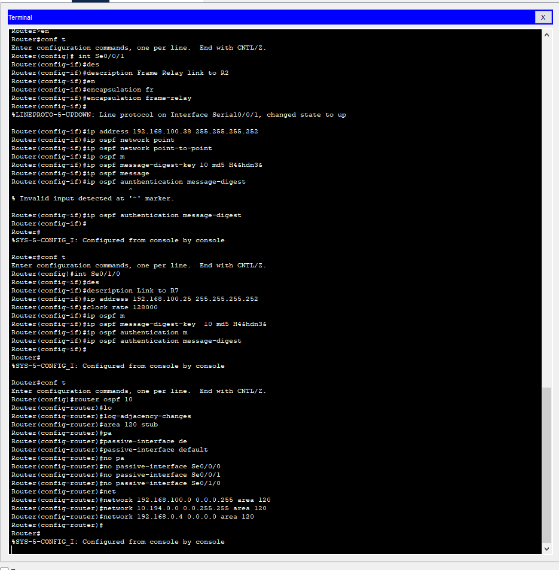

# Защита инфраструктуры маршрутизации

Автор: Синицын Даниил 932024

## Цель: 
Целью лабораторной работы является обучение методам и средствам проектирования и защиты инфраструктуры маршрутизации
отказоустойчивых иерархических компьютерных сетей на основе
протокола маршрутизации OSPF.
## Шаг 1
Настроить модель коммутаторов Frame Relay, используя
элемент Cloud-PT набора WAN Emulation.  
``Как выяснилось всё достаточно просто ``

## Шаг 2
Построить модель компьютерной сети в соответствии со
схемой, представленной на рис. 1. Определить уровень каждого
маршрутизатора СПД в ее иерархической модели. 

## Шаг 3
На маршрутизаторе R7 выполнить настройки интерфейсов, а также настройки протокола маршрутизации OSPF для области 120 (полностью тупиковой), обеспечивающие регистрацию событий
маршрутизации, аутентификацию соседей и активацию пассивных
интерфейсов: 
  
Выполнить аналогичные настройки на маршрутизаторе R6. 
 

## Шаг 4
На маршрутизаторе R4 выполнить следующие настройки
сетевых интерфейсов и протокола маршрутизации OSPF: 
 
  
Выполнить аналогичные настройки на маршрутизаторе R5.
  
  
## Шаг 5
На маршрутизаторе R3 выполнить следующие настройки
сетевых интерфейсов и протокола маршрутизации OSPF: 
 
  
выполнить аналогичные настройки на маршрутизаторе R2, дополнительно назначив ему в рамках протокола OSPF роль BDR . 
 
  
## Шаг 6
На центральном маршрутизаторе R1 выполнить следующие основные настройки:

## Шаг Фикс багов 
В процессе работы мною было допущено множество различных ошибок и были найдены баги cisco:
1) Были неверно настроены некоторые интерфейсы на маршрутизаторах R2 и R4 
2) Был неверно сконфигурирован протокол OSPF на устройстве R3 неверный параметр area
3) Как выяснилось на моей версии CPT устройство добавляло в конфигурацию условия только до перезагрузки (решилось командой `write memory (wr m)`)  
Как итог советую всегда проверять настройки ospf и интерфейсов с помощью данных команд: 
`sh ip OSPF neighbor` - показывает соседей  
`show running-config` - показывает конфиг устройства

## Шаг 7
Убедиться в корректности настроек маршрутизаторов, 
проверить возможность использования резервных маршрутов при
разрыве основных каналов связи. 

## Шаг 8
Внедрить в СПД ложный маршрутизатор. Убедиться в
невозможности установки сессий между маршрутизаторами СПД и
ложным маршрутизатором, а также внедрения ложной маршрутной
информации без знания пароля для алгоритма MD5.  
`сделать изи очно`
## Шаг 9
 К маршрутизатору R4 подключить коммутатор ЛВС. 
Проанализировать сетевые информационные потоки ЛВС и убедиться в отсутствии в ней рассылки пакетов OSPF при активации
пассивных интерфейсов.  
`сделать изи очно`