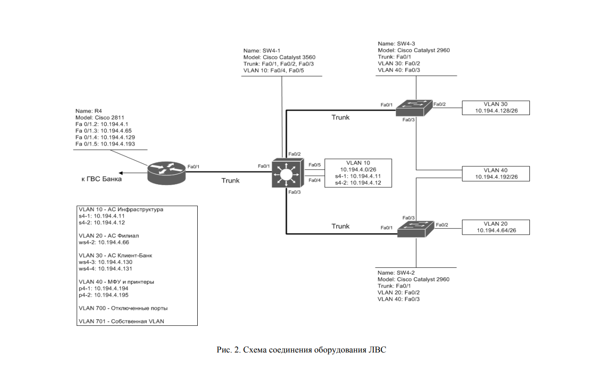
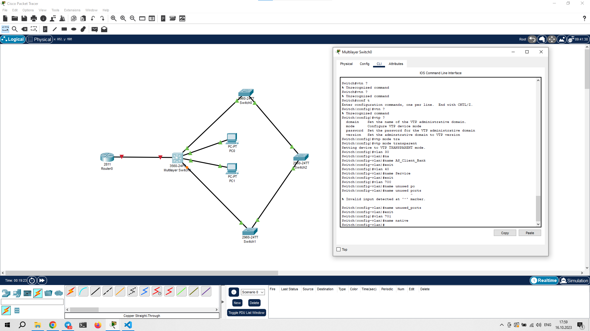
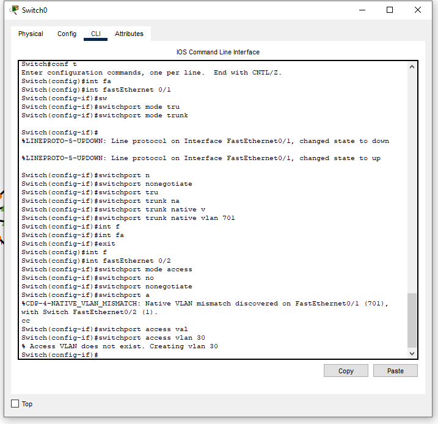
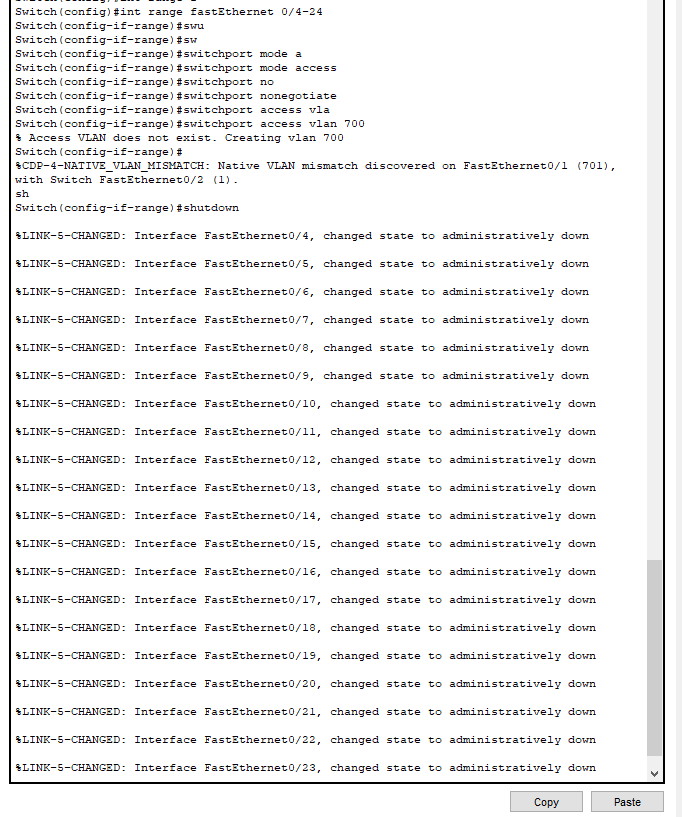
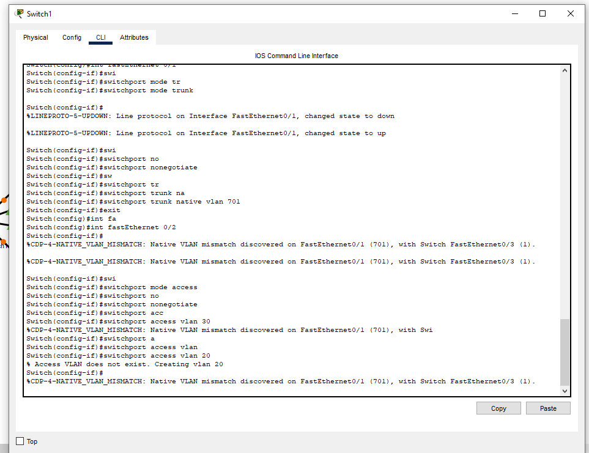
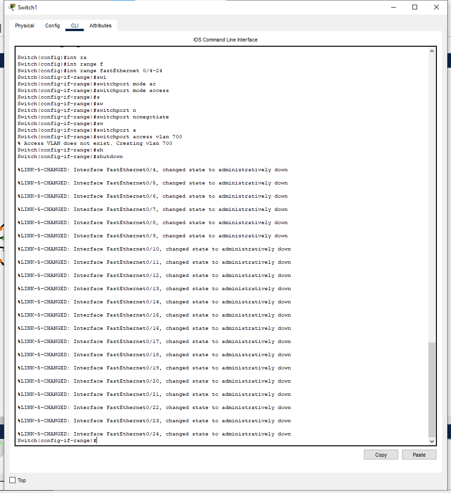
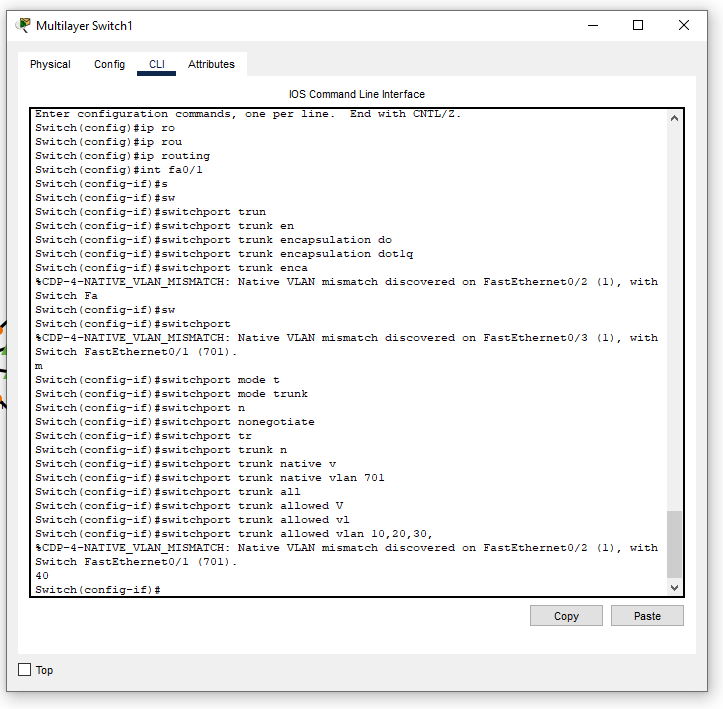
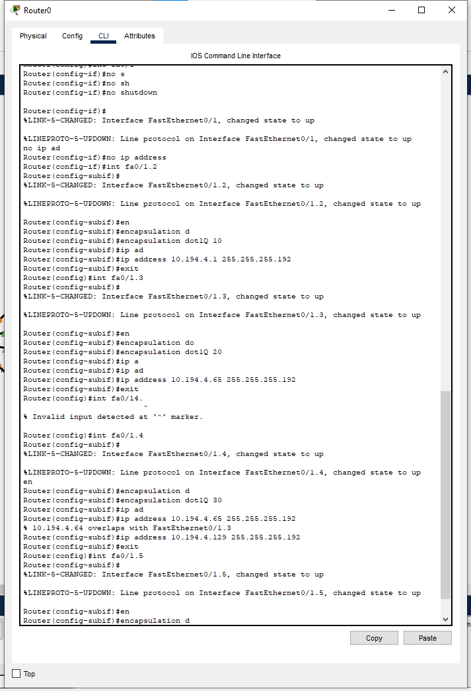
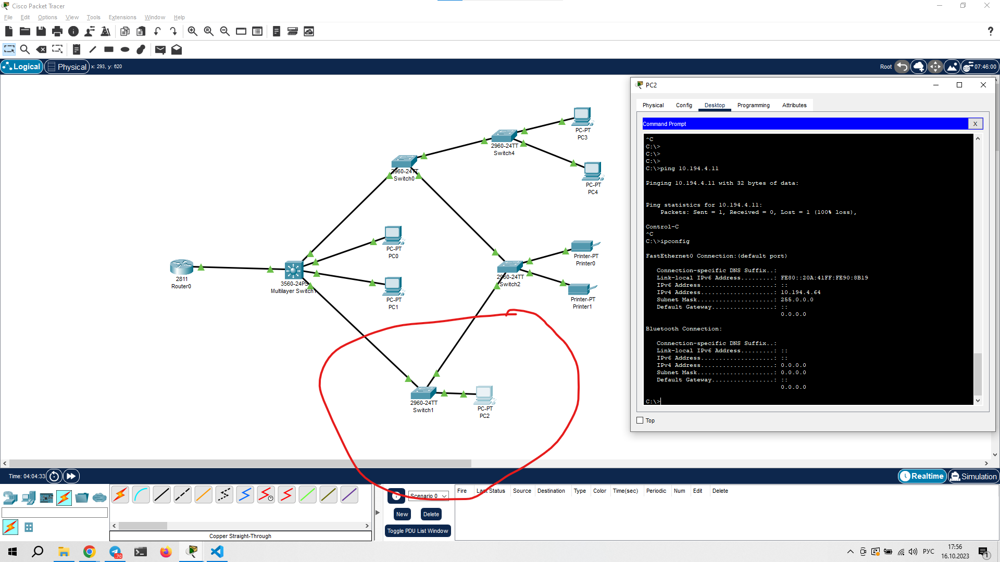

# Защита инфраструктуры коммутации
## Цель работы:
Целью лабораторной работы является обучение методам и
средствам защиты инфраструктуры коммутации при использовании
технологии виртуальных ЛВС (VLAN), их настройке и
маршрутизации.
## Постановка задачи
ЛВС филиала банка построена на базе двух коммутаторов
уровня доступа филиала Cisco Catalyst 2960 (SW4-2, SW4-3),
коммутатора уровня ядра-распределения филиала Cisco Catalyst
3560 (SW4-1) и маршрутизатора доступа Cisco 2811 (R4).
Требуется создать VLAN с номерами для рабочих станций,
принтеров и серверов банка в соответствии со схемой,
представленной на рис. 2, настроить маршрутизацию между этими
VLAN при их подключении к маршрутизатору R4 по
магистральному каналу, а также выполнить настройки в
соответствии с приведенными выше рекомендациями.  

## Шаг 1

## Шаг 2

## Шаг 3

## Шаг 4

## Шаг 5

## Шаг 6

## Проблемы
Данная лаба абсолютно не соответствует её описанию. Чтобы её сделать пришлось проделать столько дополнительных шагов. В методичке куча ошибок - короче восторг.  
пока так и не удалось наложить фикс на нижний участок сети...

## Шаг 7
Ping из верхней части подсети- есть.  
Проверять доступность заблоченных портов??? Серьёзно :)
## Шаг 8
Время идёт всё меняется https://www.petenetlive.com/kb/article/0001167  
` switchport trunk encapsulation dot1q`  

Данная команда устанавливает тип инкапсуляции для порта коммутатора в режиме "транк" (trunk) в dot1q. 

Тип инкапсуляции определяет, как данные будут упаковываться и передаваться между коммутаторами. Dot1q - это стандартный протокол VLAN, который позволяет создавать виртуальные локальные сети на одном физическом устройстве. 

Таким образом, команда switchport trunk encapsulation dot1q устанавливает протокол VLAN для транкового порта, который будет использоваться для передачи данных между коммутаторами.

