# Защита ЛВС от петель на канальном уровне 
## Цель работы
Целью лабораторной работы является изучение методов и
средств построения, защиты и оптимизации отказоустойчивых ЛВС
на основе протокола STP. 

## Постановка задачи
На коммутаторах ЛВС филиала банка выполнить настройки протокола STP и механизмов его защиты. Построенная ЛВС должна
обеспечивать состояние доступности при отказе:
- одного из коммутаторов SW7-1 или SW7-2;
- активного коммутируемого порта маршрутизатора R7;
- одной из линий связи канала EtherChannel;
- активного порта линии связи между коммутатором уровня доступа и коммутатором уровня ядра-распределения. 
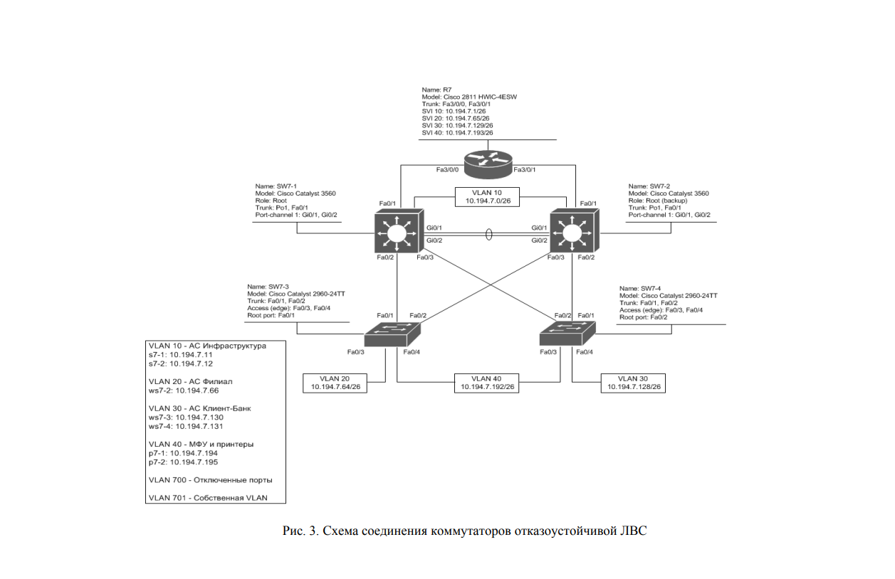
## Шаг 1
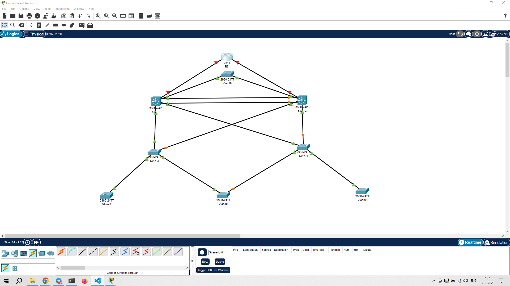
Сеть построили и плату добавили
## Шаг 2
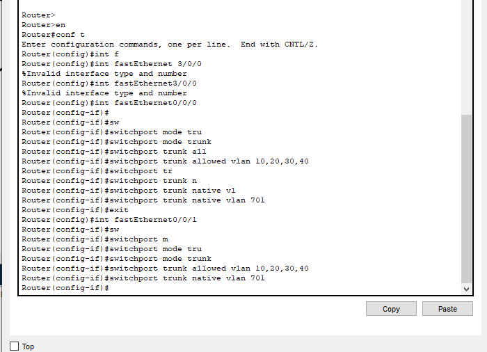
Всё настроили по инструкции
## Шаг 3
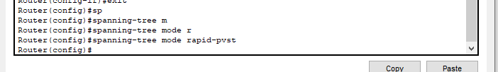
## Шаг 4
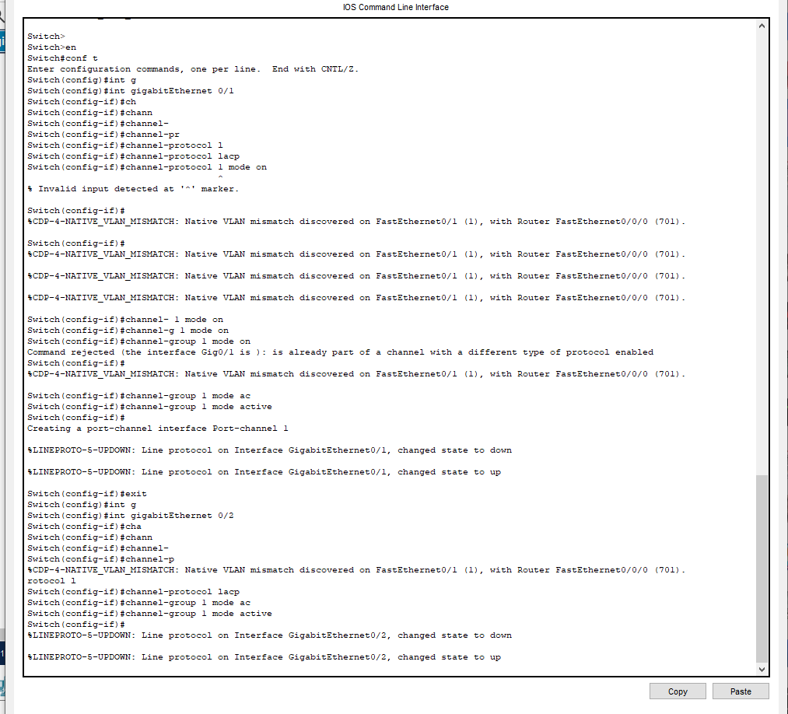
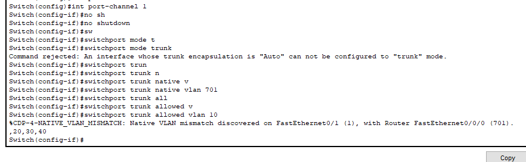
## Шаг 5
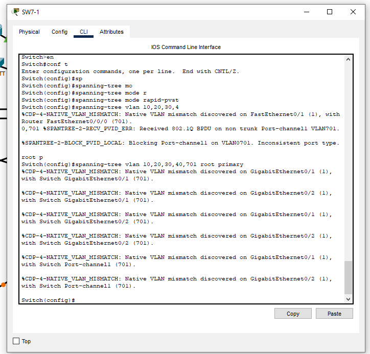
## Шаг 6
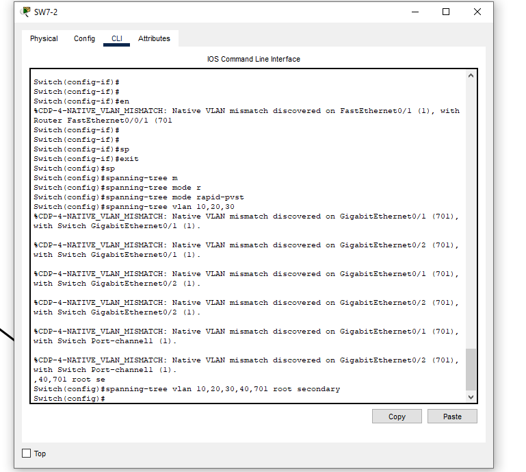
## Шаг 7
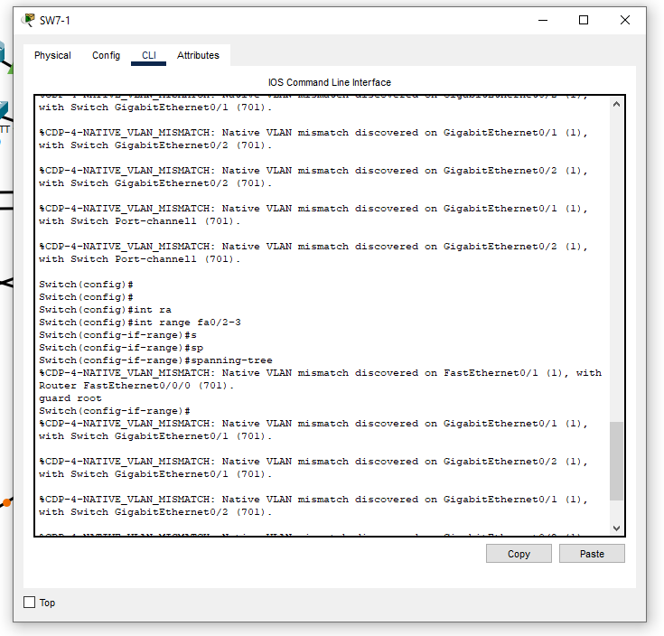
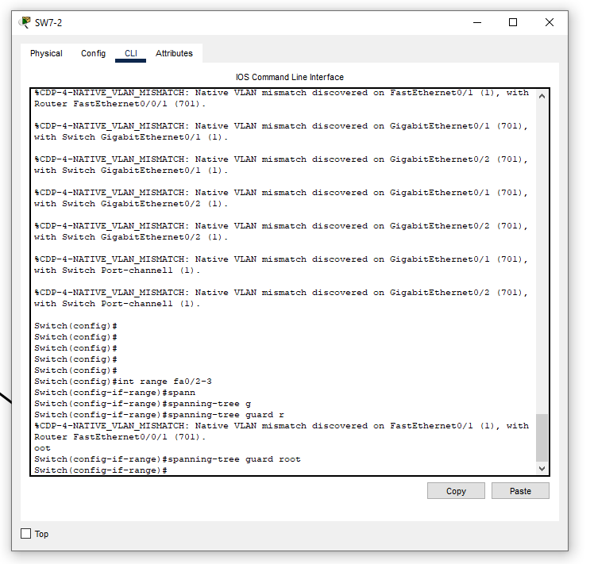
## Шаг 8
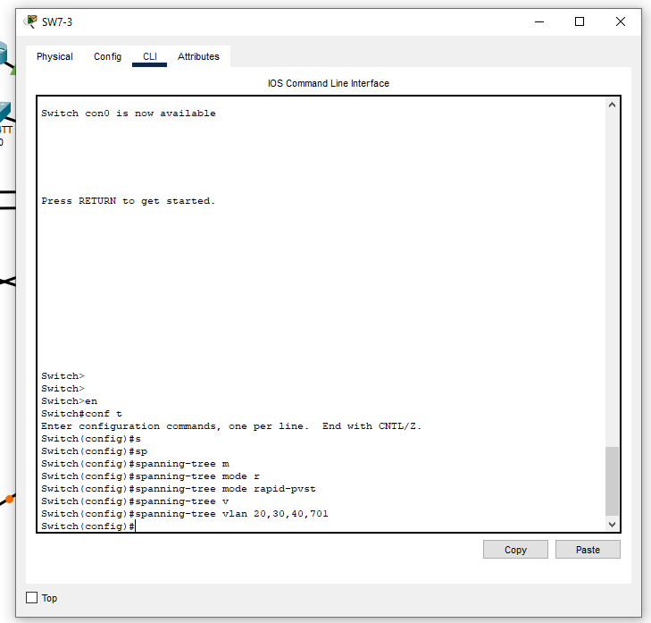
## Шаг 9
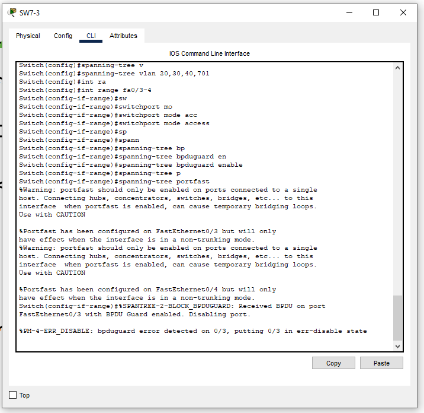
## Шаг 10
просто тестируем на то за сполько stp пересоздаст маршрут (30 секунд) - именно поэтому рекомендуют исользовать rstp

## Проблемы 
абсолютно не описаны настройки vlan- надо потратить время всё пофиксить.