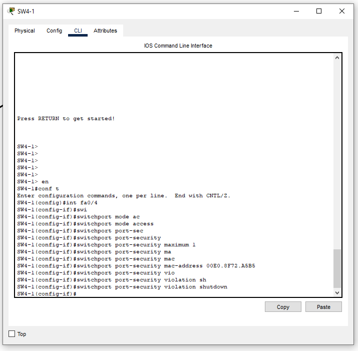

#  Защита ЛВС от атак канального уровня 
## Цель работы
Целью лабораторной работы является изучение методов
проектирования, развертывания и настройки механизмов защиты в
коммутируемых ЛВС от атак канального уровня типа MAC-flooding 
и MAC-spoofing.

## Постановка задачи

В сегменте ЛВС филиала (см. рис. 4), построенном на базе двух
коммутаторов уровня доступа Cisco Catalyst 2960 и коммутатора
уровня ядра-распределения Cisco Catalyst 3560, обеспечить защиту
от атак типа MAC-flooding и MAC-spoofing. 

## Cхема сети

## Шаг 1-2 

## Шаг 3

## Шаг 4

## Шаг 5
Проверить работу очень просто смените в конфиге устройства мас и так как у нас `switchport port-security maximum 1` у нас возможно подключение только одного устройства и там где `switchport port-security violation shutdown` линия упадёт , а где `switchport port-security violation protect` пакеты просто отбросятся.

## прочитать про работу PortSec можно тут `https://linkmeup.gitbook.io/sdsm/4.-stp/06-port-security`

## Вспомогательные команды 

