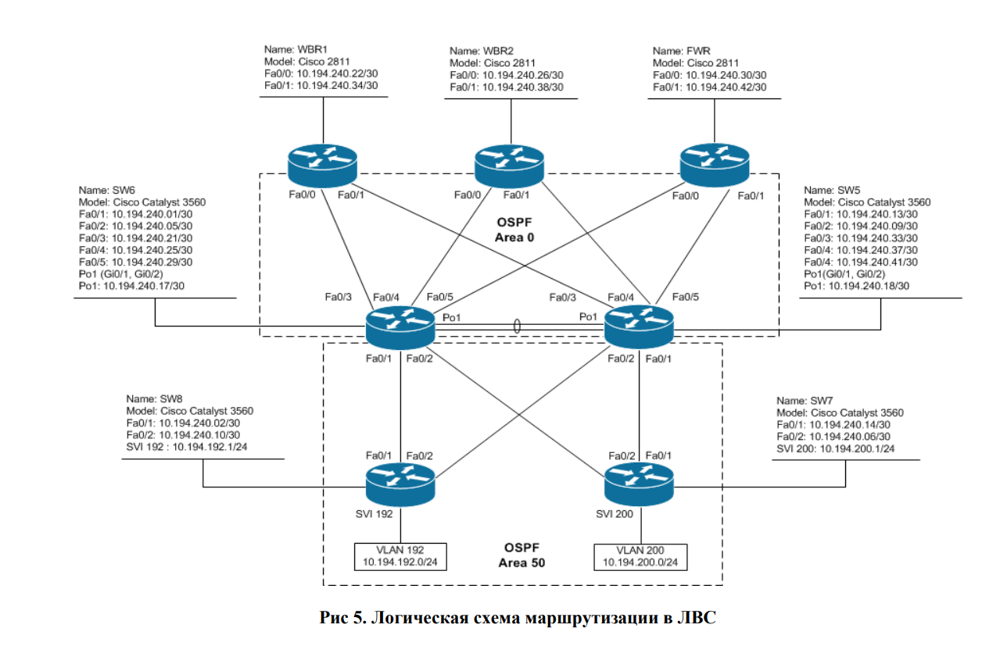

#  Построение маршрутизируемой ЛВС 
## Цель работы 
Целью лабораторной работы является обучение методам построения и настройки маршрутизируемой ЛВС с высокой доступностью
на основе протокола маршрутизации OSPF. 

## Постановка задачи
Выполнить настройки коммутаторов ЛВС банка, обеспечивающие реализацию архитектуры полностью маршрутизируемой ЛВС с
высокой доступностью. 

## Cхема сети

