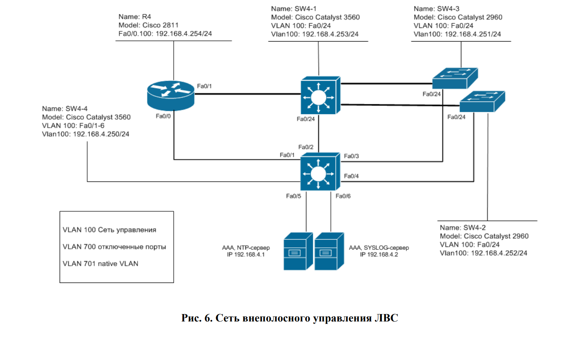

#  Защита сетевой инфраструктуры от НСД 
## Цель работы 
Целью лабораторной работы является изучение методов и средств 
защиты сетевой инфраструктуры от НСД, а также принципов 
проектирования сетей управления. 

## Постановка задачи
Организовать управление сетевым оборудованием филиала из сети 
внеполосного управления. Выполнить настройки по обеспечению защиты 
маршрутизаторов СПД. Для централизованного управления доступом к 
сетевому оборудованию банка использовать технологию AAA.
 

## Cхема сети

# Я создал пользователя noc3 с паролем abc (работает при отключенных серверах)
# noc1 - a (работает всегда)
