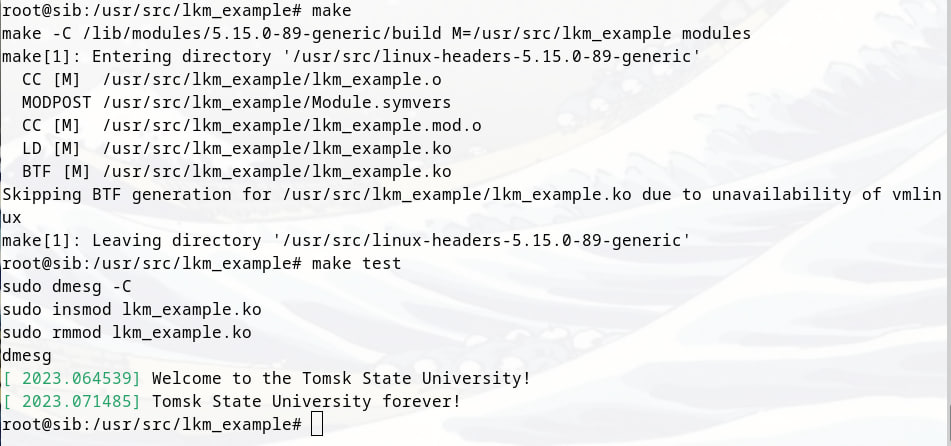

# Модуль ядра Линукс
## Требуется подготовить модуль для загрузки в ядро Linux. Модуль должен:

1) сопровождаться Makefile для сборки;
2) оформляться в виде файла *.ko;
3) загружаться командой insmod и выгружаться командой rmmod;
4) при загрузке выводить в dmesg строку «Welcome to the Tomsk State University»;
5) при выгрузке выводить в dmesg строку «Tomsk State University forever!».

## Выполнение 
1) Я копию директории сборки ядра я добавил в проект `lkm_example`
2) Чтобы не вставлять много скриншотов я добавил в makefile метод test 

### Все работает!