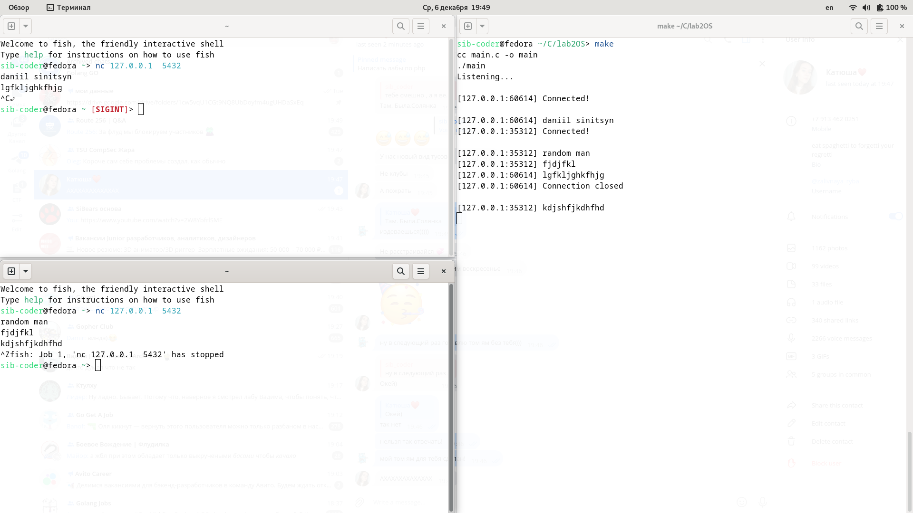

# Безопасная обработка сетевых подключений и сигналов

Требуется подготовить безопасную реализацию серверного процесса, который совмещает обработку соединений TCP/IP с обработкой сигналов (можно выбрать, скажем, сигнал SIGHUP). Приложение должно:

1) Принимать соединения на некоторый порт, сообщать о новых соединениях на терминал, одно соединение оставлять принятым, остальные закрывать сразу после подключения.
2) При появлении любых данных в соединении выводить сообщение на терминал (для простоты достаточно вывести только количество полученных данных).
3) При получении сигнала выводить сообщение на терминал.
- Фактически, работа сводится к правильному вызову функции pselect(), но все действия должны быть выполнены в предельно безопасном виде, исключающем любые race condition.
```fish
sib-coder@fedora ~/C/lab2OS> make
cc main.c -o main
./main
Listening...

^Cmake: *** [Makefile:3: all] Прерывание

```
